*
 Vikram Procter, Minh Do | Dec, 2025 
*

# Relay Machine - 4-bit Computer Made of Relays

## TODO
- Fix REGister LED indicator order (right most should be Q0 as its LSBs)

## Project Overview

This project implements a very simple 4-bit computer architecture 

## Systems Overview
-   ALU (computes numbers)
-   Program Memory (the program with program counter)
-   Registers (Random Access Memory)
-   Display / Routing / Clock (Displays Register Values, connections between boards)

## Components
### Relays
Using a 24V 0.15W relay [J104D2C24VDC.15S](https://www.digikey.ca/en/products/detail/cit-relay-and-switch/J104D2C24VDC-15S/12502730)

### Flyback Diodes
Using a uni-directional TVS diode [SMAJ24A](https://www.digikey.ca/en/products/detail/littelfuse-inc/SMAJ24A/762288)

### Red LED 
For important lines LED indicator [151051RS11000](https://www.digikey.ca/en/products/detail/w%C3%BCrth-elektronik/151051RS11000/4490012)

### 1.3k Resistor
Using a 1.3k resistor (2512) for current limiting LEDs [RMCF2512FT1K30](https://www.digikey.ca/en/products/detail/stackpole-electronics-inc/RMCF2512FT1K30/1758253)  

### Board to Board Connector
Board Connector 20pos 2row rectangular connector [61202021621](https://www.digikey.ca/en/products/detail/w%C3%BCrth-elektronik/61202021621/2060592)  
Cable assembly housing keyed [61202023021](https://www.digikey.ca/en/products/detail/w%C3%BCrth-elektronik/61202023021/2060600)  
Ribbon cable 20 wire 28AWG stranded [3365/20 300](https://www.digikey.ca/en/products/detail/3m/3365-20-300/1107221) or 30AWG solid [3749/20 300](https://www.digikey.ca/en/products/detail/3m/3749-20-300/22532463)

From Amazon:
General 20pos connector [here](https://www.amazon.ca/MECCANIXITY-Ribbon-2-54mm-Connector-Displays/dp/B0DQCVXGWG/ref=sr_1_1_sspa)

### Power Supply
Also avalible on amazon [here](https://www.amazon.ca/dp/B0C4YGWZQQ/ref=sspa_dk_detail_4?)

### Board Spacers 
Hex 25mm female to female M3 threaded spacer [24438](https://www.digikey.ca/en/products/detail/keystone-electronics/24438/1532170)

## Gate Implementations with Relay
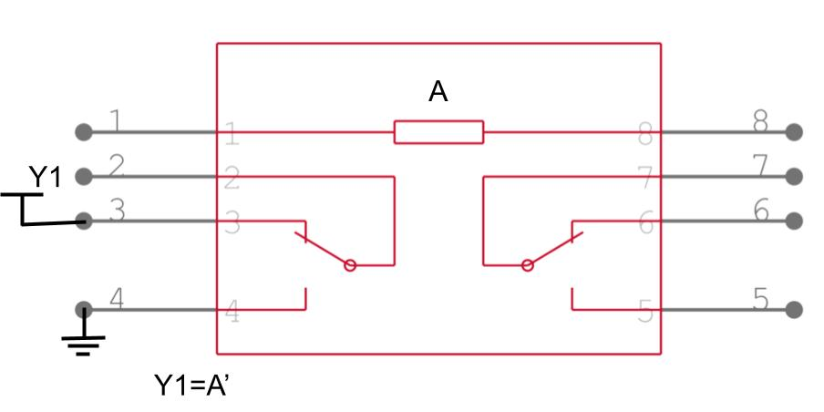
*NOT Gate Y=A'*

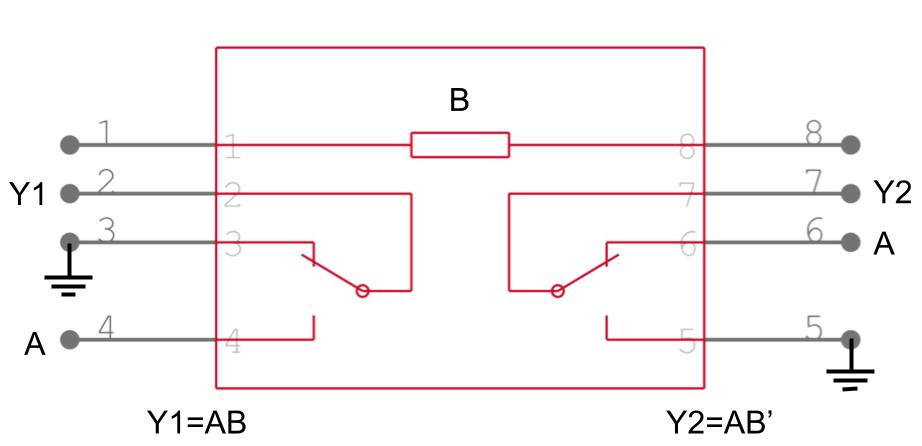
*AND Gate Y1=AB and Y2=AB'*

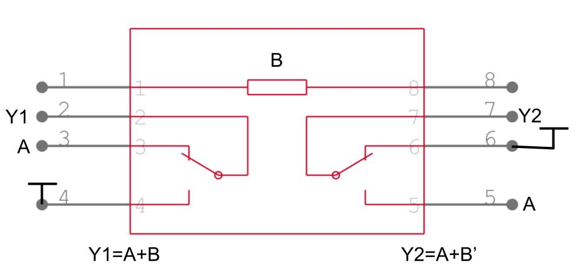
*OR Gate Y1=A+B and Y2=A+B'*

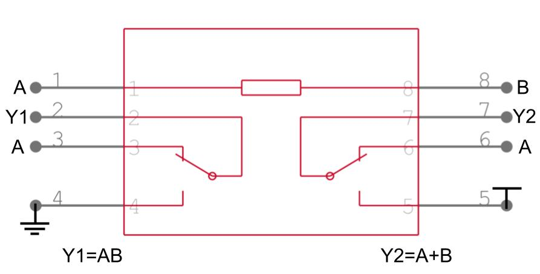
*AND or OR Gate from XOR inductor Y1=AB and Y2=A+B*

'.jpg)
*XOR and XNOR Gate Y1=AxB and Y2=(AxB)'*

.jpg)
*XOR AND and XNOR AND Gate Y1=C(AxB) and Y2=C(AxB)'*

## OP-Codes
### ALU Operations:
- ADD  (addition)
- SUB  (subtraction)
- AND  (bitwise AND)
- OR   (bitwise OR)
- XOR  (bitwise exclusive OR)
- LS   (Logic shift both ways)

### Registry Operations:
- LDI  (Load immediate)
- MOV  (Move data from reg to reg)

### Program Counter Operations
- BRGE (branch if greater or equal)
- BREQ (branch if equal)
- JMP  (jump program counter)

### Miscellaneous Operations
- NOP  (No Operation)

| OpCode [3:0]   | Top [3:0]  | Bottom [3:0]  | Description       |
| -------------- | ---------- | ------------- | ----------------- |
| 0000           | 0000       | 0000          | NOP: No Operation |
| 0001           | dddd       | rrrr          | ADD: Rd ← Rd + Rr |
| 0010           | dddd       | rrrr          | AND: Rd ← Rd & Rr |
| 0011           | dddd       | rrrr          | OR:  Rd ← Rd o Rr |
| 0100           | 0000       | 0000          | Not Defined
| 0101           | dddd       | rrrr          | SUB: Rd ← Rd - Rr |
| 0110           | dddd       | rrrr          | LSL: Rd ← Rd << 1 |
| 0111           | dddd       | rrrr          | LSR: Rd ← Rd >> 1 |
| 1000           | kkkk       | kkkk          | JMP: PC ← PC + k + 1 |
| 1001           | dddd       | kkkk          | LDI: Rd ← K
| 1010           | 0000       | 0000          | XOR: Rd ← Rd x Rr |
| 1011           | dddd       | rrrr          | MOV: Rd ← Rr
| 1100           | dddd       | kkkk          | BRGE: PC ← PC + k + 1 if Rd >= R1 |
| 1101           | dddd       | kkkk          | BREQ: PC ← PC + k + 1 if Rd == R1 |
| 1110           | 0000       | 0000          | Not Defined
| 1111           | 0000       | 0000          | Not Defined

## ALU Design
INPUT: 2x 4-bit buses containing the values that will be mathed

CONTROL: OP-Code control lines to select which math to be done 

OUTPUT: 2x 4-bit buses containing the outputs from the math

### Adder

*One bit adder circuit* [Source](https://www.build-electronic-circuits.com/full-adder/)

We will utilze 4 of these modules to add the 4-bit input in a ripple carry topology

### AND/OR
Utilzize only 4 relays to do both the AND and the OR operations

### Shifters
Should not need any gates other than MUXes for outputs

Output for both Left and Right shift should be outputed on the Top and Bottom words of the output of the ALU

### MUXs
Relays themselves act as MUXes 

## Program Memory

Rough Plan is to use a bunch of dipswitches to manual program in each line of OP-Codes 

Along with a big MUX to then select which opcode line we are at based on the Program counter (PC)

## Registers

**Typically:** a NAND based solution is used given normal people use the CMOS structure, however... NAND and NOR requires lots of relays 
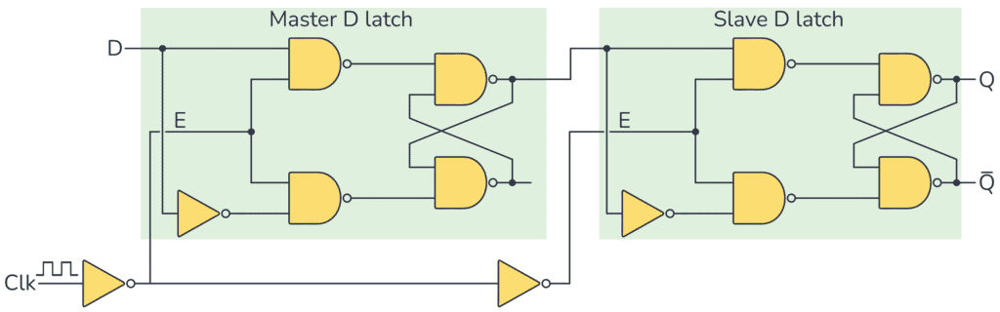
*D Flip Flop NAND Based Circuit* [Source](https://www.build-electronic-circuits.com/d-flip-flop/)

or an alternative structure could be the NOR version
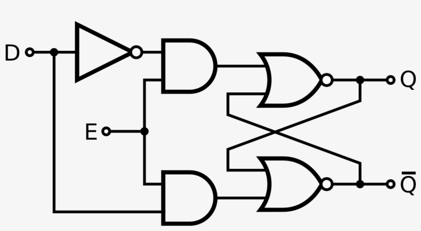
*D Latch NOR Based Circuit* [Source](https://en.wikipedia.org/wiki/Flip-flop_(electronics))

This non NAND/NOR based SR latch wil be used to reduce the number of relays 

*AND-OR SR Latch Circuit* [Very Good Source](https://en.wikipedia.org/wiki/Flip-flop_(electronics))

Final relay implementation will follow this gate layout
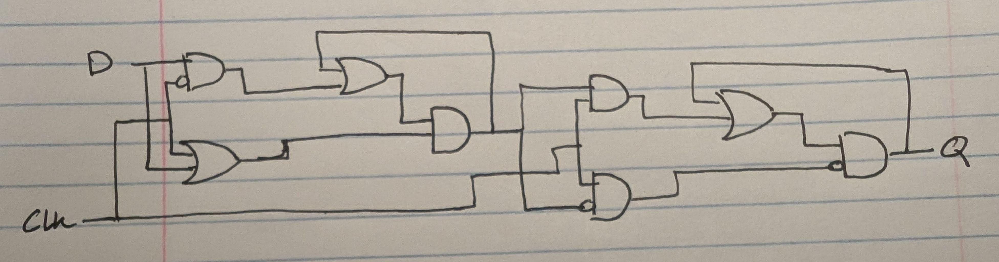

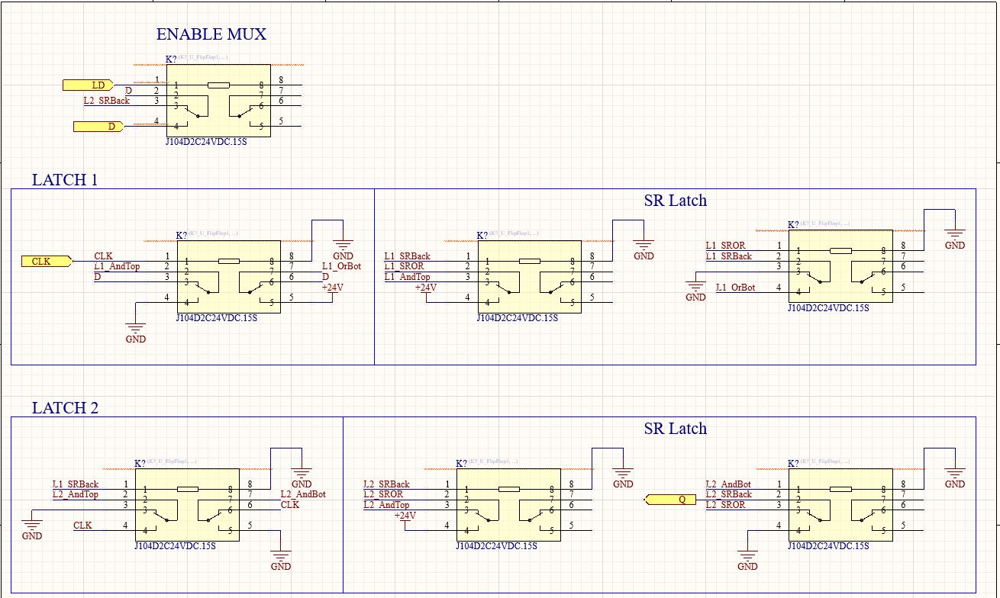

**Read Topology:**
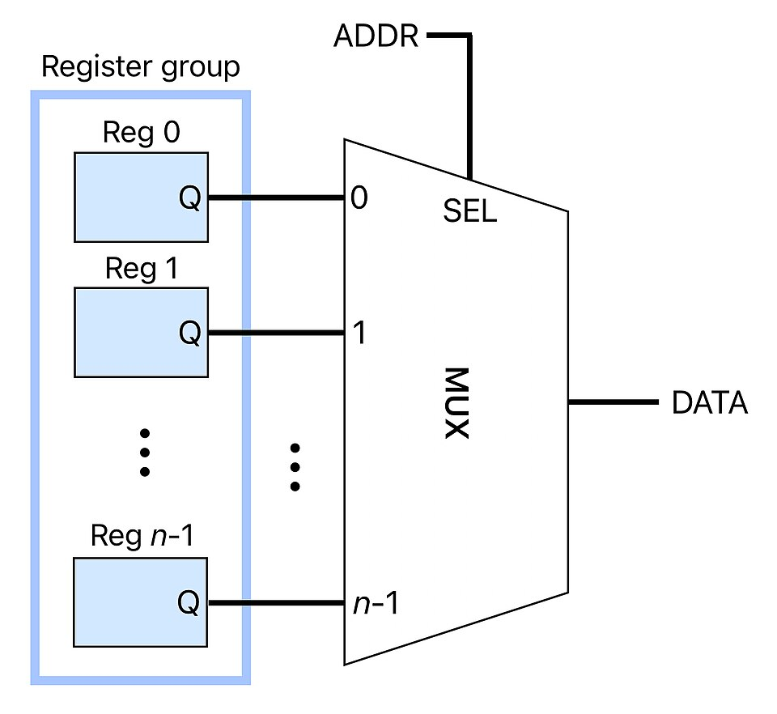
*Addressable Read Register* [Source](https://en.wikipedia.org/wiki/Hardware_register)
by using cascading 4-bit MUX2s we can accomplish a full MUX8, one for each possible register. 

**Write Toplogy**
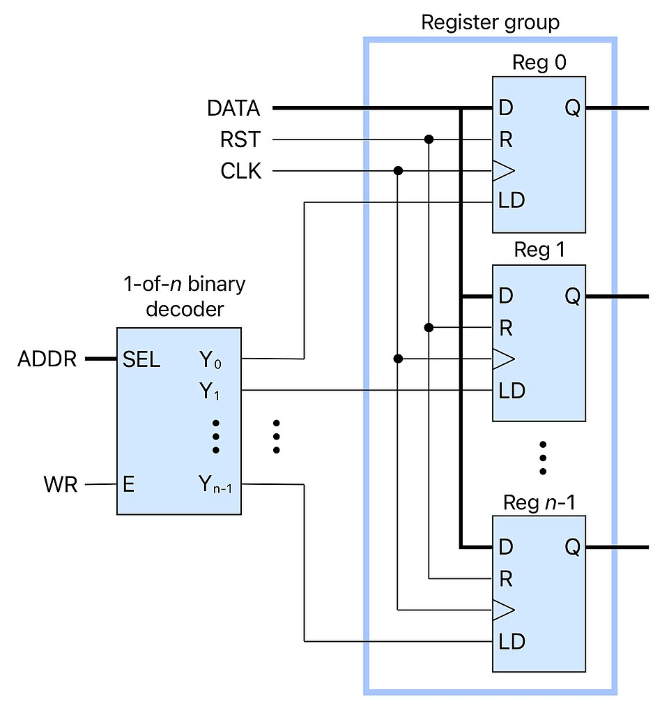
*Addressable Write Register* [Source](https://en.wikipedia.org/wiki/Hardware_register)
To create the decoder the only 3-input gate we can use is the XOR-AND gate so optimizing with that:

2&3&7, 24
5&1&7, 50
4&6, 12

$LD_0=$  
$LD_1=\overline{[A_{B0} \&\overline{(A_{B0}\oplus A_{B2})}]}\&[A_{B0} \&(A_{B0}\oplus A_{B1})]$  
$LD_2=[A_{B1} \&\overline{(A_{B2}\oplus A_{B0})}]\&[A_{B1} \&(A_{B1}\oplus A_{B2})]$  
$LD_3=\overline{[A_{B1} \&\overline{(A_{B2}\oplus A_{B0})}]}\&[A_{B1} \&(A_{B1}\oplus A_{B2})]$  
$LD_4=[A_{B2} \&\overline{(A_{B1}\oplus A_{B0})}]\&[A_{B2} \&(A_{B0}\oplus A_{B2})]$  
$LD_5=[A_{B0} \&\overline{(A_{B0}\oplus A_{B2})}]\&[A_{B0} \&(A_{B0}\oplus A_{B1})]$  
$LD_6=\overline{[A_{B2} \&\overline{(A_{B1}\oplus A_{B0})}]}\&[A_{B2} \&(A_{B0}\oplus A_{B2})]$  
$LD_7=[A_{B1} \&\overline{(A_{B2}\oplus A_{B0})}]\&\overline{[A_{B1} \& (A_{B1}\oplus A_{B2})]}$

$LD_2=[A_{B1} \&\overline{(A_{B2}\oplus A_{B0})}]\&[A_{B1} \&(A_{B1}\oplus A_{B2})]$  
$LD_3=\overline{[A_{B1} \&\overline{(A_{B2}\oplus A_{B0})}]}\&[A_{B1} \&(A_{B1}\oplus A_{B2})]$ 
$LD_7=[A_{B1} \&\overline{(A_{B2}\oplus A_{B0})}]\&\overline{[A_{B1} \& (A_{B1}\oplus A_{B2})]}$

$LD_1=\overline{[A_{B0} \&\overline{(A_{B0}\oplus A_{B2})}]}\&[A_{B0} \&(A_{B0}\oplus A_{B1})]$
$LD_5=[A_{B0} \&\overline{(A_{B0}\oplus A_{B2})}]\&[A_{B0} \&(A_{B0}\oplus A_{B1})]$  

$LD_4=[A_{B2} \&\overline{(A_{B1}\oplus A_{B0})}]\&[A_{B2} \&(A_{B0}\oplus A_{B2})]$  
$LD_6=\overline{[A_{B2} \&\overline{(A_{B1}\oplus A_{B0})}]}\&[A_{B2} \&(A_{B0}\oplus A_{B2})]$  

## Clock

Could use a RC circuit to generate a delay and use the relay itself to produce the cyclical behaviour.

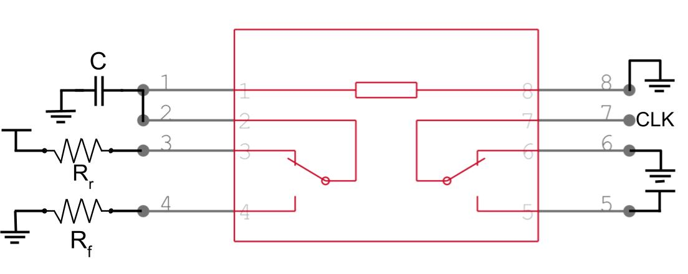

By scaling the resistors and the capacitor various clock speeds and high/low time can be configured.

The timing should follow these equations given that clock period >> 6ms (relay actuation time)

$t_{low}=-R_r\cdot C\cdot \ln(1-\frac{V_{pickup}}{V_{DD}})$

$t_{high}=-R_f\cdot C\cdot \ln(\frac{V_{drop}}{V_{DD}})$

From the relay data sheet the $V_{pickup}=18V$ and the $V_{drop}=2.4V$

Max Capacitor current is:
$I_{max}=\frac{V_{DD}}{R}$

To keep the max current draw low like <5mA, R should be greater than 5kΩ

A 33kΩ resistor provides a current of 0.73mA keeping overall power low

Based on this resistor range a capacitance of around 4µF will be targeted. By using 8, 0.5µF caps all at 5% tolerance error should be low.  

For a 5Hz clock a period of 0.2s, using a 4µF capacitor the resistances required are:

$R_r=\frac{t_{low}}{C\cdot \ln(1-\frac{V_{pickup}}{V_{DD}})}=\frac{0.2s}{4µF\cdot \ln(1-\frac{18V}{24V})}=36.06737k\Omega$ 

$R_f=\frac{t_{high}}{C\cdot \ln(1-\frac{V_{drop}}{V_{DD}})}=\frac{0.2s}{4µF\cdot \ln(\frac{2.4V}{24V})}=21.7147k\Omega$ 

In conclusion, the resistor and capacitor values are as follows:

$C=4µF=8\cdot 0.5µF$  
$R_r=36.06737k\Omega$  
$R_f=21.7147k\Omega$

Possible 0.5µF film cap is [B32652A3504J000](https://www.digikey.ca/en/products/detail/epcos-tdk-electronics/B32652A3504J000/3491572)

## Op-Code Routing
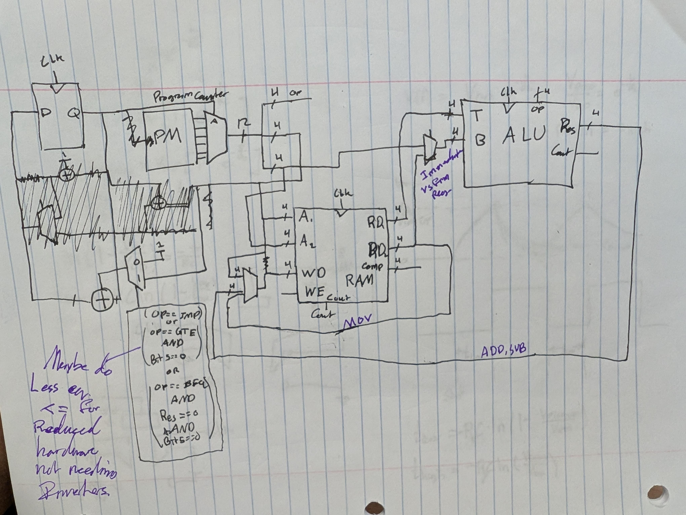